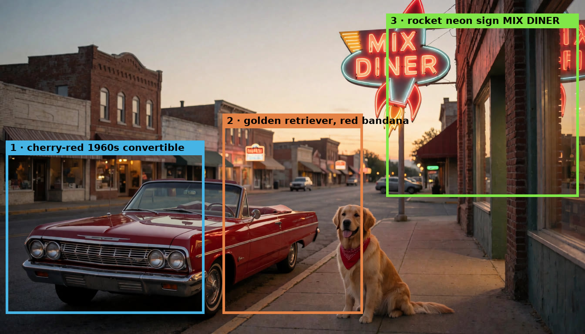

# Mix Studio

Mobile-first local AI studio built around curated image and video models, workflow-tested settings, and the Modatory design language. Generations run through **ComfyUI** on the Windows desktop; you drive the optimized workflows from your phone on the same Wi-Fi or through Tailscale. Zero app dependencies: one Node.js server, vanilla JS frontend, no build step.

> Working on this codebase (human or AI agent)? **Read `AGENTS.md` first.**

## Showcase

Everything below was generated locally in Mix Studio — most of it from a phone. More examples (including autoplaying video) on the **[showcase & download page](https://blackmixture.github.io/Mix-Studio/)**.

### Edit — describe the change, keep the scene

Multi-model editing (Flux 2 Klein 4B/9B, Qwen Image Edit 2511, Krea 2): one sentence in, the rest of the photo stays put.

| “Make the man an old black man with a gold chain and a hat” | “Make the rose into a gun” |
| --- | --- |
|  |  |

| “Make this a 3D render. Wireframe draft view.” | Mask inpainting — paint the face, only the face changes |
| --- | --- |
|  |  |

### Outpaint — extend the canvas

A square generation continued into a seamless 21:9 interior.


### Regional prompting — draw boxes, direct the scene

Each box carries its own prompt (and optionally its own LoRA and reference image). No general prompt required.

| The boxes | The generation |
| --- | --- |
|  |  |

### Depth guide — new image, same 3D structure

Depth Anything V3 extracts the structure of a source image; a Krea 2 Control LoRA locks the generation to it. Source → depth map → result:


### Reference-guided generation

One reference image steers composition and mood for an entirely new subject.


### Video

Click to play — or see them looping on the [showcase page](https://blackmixture.github.io/Mix-Studio/).

| | |
| --- | --- |
| [**SCAIL 2 motion transfer** — a phone clip of a hand becomes a fantasy world, motion intact](docs/download/media/scail-hand-fantasy.mp4) | [**SCAIL 2** — dog-walk clip re-rendered as a mech walking a robot dog](docs/download/media/scail-mech-dog.mp4) |
| [**Face ID lipsync** — one selfie + one voice recording = identity-locked talking video (LTX 2.3)](docs/download/media/lipsync-talking.mp4) | [**LTX 2.3 image-to-video** — a still generation brought to life with audio](docs/download/media/ltx-shark.mp4) |

## Inside the app

The desktop workspace — the same server drives the phone layout.

| Create — build, watch, and browse in one screen | Region — draw boxes, direct the scene |
| --- | --- |
|  |  |

| Edit — one sentence in, the scene stays put | Video — LTX 2.3 with end frame and audio attached |
| --- | --- |
|  |  |

| SCAIL 2 — motion transfer workspace | Library — search, folders, and grouped videos |
| --- | --- |
|  |  |

| Lightbox — the full generation recipe | Compare — original ↔ upscaled reveal |
| --- | --- |
|  |  |

| Profiles — who's creating? | Desktop Dependencies — everything green |
| --- | --- |
|  |  |

Short clips of the UI in motion: [region prompting](docs/download/media/ui-region-demo.mp4) · [before/after reveal](docs/download/media/ui-compare-demo.mp4)

## Portable Windows install

This project is distributed as a portable Git checkout rather than a packaged executable. That keeps installation transparent for advanced users and lets the owner-only **Update app** button safely run a fast-forward Git update.

The downloadable bootstrap installs Git and Node.js through `winget` when needed, clones the official repository into `%USERPROFILE%\Mix Studio`, starts the local server, and opens Mix Studio in the browser. A fresh installation enters an open **Owner** workspace immediately. ComfyUI, models, and custom nodes are configured later from the web app, only when a generation needs them. Existing ComfyUI installations and completed model files are reused.

### One-file download

On Windows, open the [Mix Studio download page](https://blackmixture.github.io/Mix-Studio/), save **install.bat**, and run it. The downloader fetches the application, starts it, and opens `http://127.0.0.1:3300/`. There is no separate Mix Studio setup wizard before the workspace appears.

When the user first presses Generate, Mix Studio checks the exact workflow they selected. If ComfyUI, models, or nodes are missing, the in-app **Generation setup** panel offers three paths: **Quick setup** installs the recommended image starter, **Install this workflow** downloads only what the current generation requires, and **Full setup guide** exposes ComfyUI detection, manual URL and folder fields, and individual capability groups. The panel reads NVIDIA VRAM and system RAM, identifies the curated precision variant, and labels model families as recommended, usable with offload, or difficult. Below-minimum choices require an explicit warning confirmation. A running ComfyUI is queried for registered model filenames, so matching files are reused even when they live in a shared model root.

### Manual Git install

1. Install [Git for Windows](https://git-scm.com/download/win) and Node.js 22 or newer.
2. Clone the repository. Do not use GitHub's **Download ZIP** if you want in-app updates:

   ```powershell
   git clone https://github.com/BlackMixture/Mix-Studio.git
   ```

3. Open the cloned folder and double-click **install.bat**. Mix Studio starts and opens directly in the browser.
4. Enter a prompt and press **Generate**. If the selected workflow is not ready, choose **Quick setup**, install only that workflow, or open the full guide.
5. In the full guide, choose the detected ComfyUI environment, enter a URL and folders manually, or launch the signed official ComfyUI Desktop installer.
6. Review the hardware rating before adding larger Edit and Video families. Some selections can add tens of gigabytes or rely heavily on system-memory offload.

The bootstrap writes ignored, machine-specific configuration to `install.json`. Changes made in Generation setup update the ComfyUI connection atomically and merge the URL into `data/settings.json`. Setup never resets `data/db.json`, profiles, gallery media, folders, prompts, or presets.

The console prints two URLs:

   - `Local:  http://localhost:3300` — on the desktop
   - `Phone:  http://192.168.x.x:3300` — open on your phone (same Wi-Fi)

On the phone, use **Add to Home Screen** for an app-like fullscreen experience.

For private access away from home, install [Tailscale](https://tailscale.com/download) on both the Windows desktop and phone, sign both into the same tailnet, then open the `Phone:` URL printed for the Tailscale adapter. The desktop keeps ComfyUI, models, and generated media; the phone remains the touch-first control surface.

If the phone can't connect, allow Node through Windows Defender Firewall (private networks). Port changes via the `PORT` env var.

### ComfyUI and shared models

For new machines, the in-app guide downloads ComfyUI Desktop only from the official stable Windows endpoint and refuses to run it unless Windows reports a valid Authenticode signature. Existing environments can provide their ComfyUI URL, application folder, and models folder. Setup scans the connected `/object_info` registry and common `extra_model_paths.yaml` files, shows what it found, and skips recognized filenames before downloading. If ComfyUI is stopped or uses an unusual configuration location, enter the folders manually; no existing file is moved or duplicated.

You can reopen **Generation setup** later from **Advanced Settings → General** to change the connection or add optional feature families. Rerunning **install.bat** is safe and simply prepares and starts the existing checkout again.

To remove Mix Studio, double-click **uninstall.bat**. The uninstaller removes the portable checkout and, by default, moves its managed `data/` folder to `%LOCALAPPDATA%\Mix Studio\data` so the original checkout path is free for a clean reinstall. A later setup automatically reconnects those profiles, settings, generations, ComfyUI paths, and the last detected hardware profile. Use the explicit `-RemoveData` option only when you also want to erase managed local gallery data and preserved setup metadata; it requires typing `DELETE`. ComfyUI, shared models, mirrored export files, arbitrary external data paths, and the system Node.js installation are never removed. Browser-installed shortcuts, local form settings, and compressed preview caches live on each phone or browser and must be cleared there.

### Installing missing dependencies

In **Advanced Settings → General**, the **Desktop Dependencies** card scans every enabled Mix Studio model and node family. The owner profile can install only the red groups; node packs are cloned into the configured `custom_nodes` directory and their requirements are added with that ComfyUI instance's Python environment **without a blanket pip upgrade**. Before any node requirements are changed, Mix Studio saves a `pip freeze` snapshot under `data/dependency-backups/`. Model files download into the configured shared models folder with live byte progress, and partial downloads are kept as `.mixbox.part` files until complete.

Use **Repair missing tools** after an interrupted install or a custom-node dependency conflict. It reinstalls only the affected packs' declared Python packages, then asks for a ComfyUI restart; it does not reset profiles, gallery data, model files, or unrelated custom nodes.

Some upstream Hugging Face files require accepting a license before their download URL will work. Accept the license on the model page first; if the provider requires authentication, launch Mix Studio with an `HF_TOKEN` environment variable. The card also exposes **Restart ComfyUI** for a configured Windows ComfyUI folder, but it will refuse while either queue is active.

### Updating

Open Mix Studio's side menu and choose **Update app**. Updates require:

- a Git clone with its `.git` directory;
- a named branch and configured `origin` remote;
- no uncommitted tracked code changes; and
- idle Mix Studio and ComfyUI queues.

Machine-specific `install.json` and all `data/` content are ignored by Git, so normal updates do not replace profiles, settings, metadata, or generations. Server-side updates restart the Node process automatically; frontend-only updates do not need a restart.

The owner can also choose **Restart app** from the same menu. It checks both Mix Studio and ComfyUI queues before restarting the Node server, and is available because `start.bat` launches the server in restart-aware mode.

## Features

**Profiles** — Netflix-style profile picker with avatars and optional PINs. Every profile has its own gallery, folders, history, LoRA presets, Face ID library, and form state. The first profile owns profile management. Signed-cookie sessions; rolling db backups (boot + every 30 min).

**Create (text-to-image)** — Krea 2 Turbo by default, with a Raw checkpoint switch (Raw starts with the Turbo LoRA at 0.6/12 steps and can fall back to full 52-step CFG sampling); optional image-to-image guidance with either pixel influence or **Depth Anything V3 structural control**; generation-safe or native source-size matching; ✨ prompt enhance via Qwen3-VL; collapsible resolution selector with live aspect glyph; camera-settings helper; image→prompt vision tool; **regional prompting**: draw boxes on an aspect-true canvas, per-region prompt/LoRA/reference, no general prompt required, gallery hold-preview + color-coded annotated PNG export.

**Edit** — Flux 2 Klein 4B/9B multi-reference editing (numbered slots: "the jacket from image 2"), Qwen Image Edit 2511 with Fast/Quality sampling, camera variations for Qwen and Klein, sequential sentence-by-sentence edits, **Krea2 mask inpainting** (paint the mask, denoise = change strength, mask preview on the slot), draggable source-placement outpainting across every Edit model, organic subject-preserve masks, automatic SeedVR2 detail refinement for large Native Preserve canvases, Krea 2 reference editing, KleinEditComposite preserve-unchanged, hold-to-compare original.

**Video** — five engines with per-engine contextual controls:
- **LTX 2.3**: two-stage, 25 fps, generates audio, t2v/i2v, end frames, audio-driven with waveform trimming, motion freedom
- **LTX Face ID**: reference-to-video identity preservation (Best-FaceID + BFS overlap node), 24 fps, named face library, **your-own-voice lipsync** — attach a recording and it is frozen into the audio latent (`SetLatentNoiseMask 0.0`) so the joint AV denoise syncs the lips to it; leave audio off and the model invents a voice from a scripted line in the prompt
- **10Eros DMD**: Echo sampler, reference conditioning, sigma presets
- **Wan 2.2**: 14B dual-expert i2v, 4-step or full quality
- **SCAIL 2**: motion transfer from a driving video (SAM3 tracking), trim UI, first-frame→Edit, chunked/Infinity long-video modes
- Plus: RIFE 32/48 fps interpolation (16 fps engines), RTX 4K pass, side-by-side comparison export, per-video reuse (restores settings *and* input assets)

**LoRAs** — card grid shared by every tab: tap to toggle, hold-and-slide to adjust strength, thumbnails, searchable picker (also used for region LoRAs), server-stored presets.

**Gallery** — folders with PIN-locked privates (items can be dropped in without unlocking; viewing requires the PIN), folder merge, animated sort and date controls, search, long-press + drag-sweep multi-select, selection insights, ZIP/group/composite actions, shareable documentation PNGs, searchable gallery source picker, optional browser preview cache, improved inline video playback, full-page swipe viewer, videos grouped under their source image, queue viewer with per-profile history and GPU health, and optional mirroring to a desktop export folder.

**Upscale** — SeedVR2 (selectable attention backend) and Ultimate SD Upscale, with a before/after detail viewer that supports reveal, pan, pinch or wheel zoom, 1:1, and fit controls.

**Responsive workflow feedback** — animated image and video previews keep the stage active while ComfyUI works, with progress labels and ETA estimates. System settings report GPU, CPU, memory, OS, and storage status without leaving the app.

**Remote maintenance** — the owner can update or safely restart the desktop app from a phone. Updates require a clean checkout; updates and manual restarts both wait for idle Mix Studio and ComfyUI queues.

## ComfyUI requirements

All model filenames and the ComfyUI URL are editable in **Settings (gear) → Save & test connection**, which health-checks every node group. Highlights: Krea 2 (unet/clip/vae), Krea 2 Depth Control LoRA + Depth Anything V3 Large, Krea 2 Identity Edit LoRA + ComfyUI-Krea2Edit for outpainting, Flux Klein 4B/9B, Qwen Image Edit 2511, LTX 2.3 (+ spatial upscaler, Gemma encoder), Wan 2.2, 10Eros, SCAIL-2 (+ SAM3 multiplex, clip_vision_h), Best-FaceID LoRA + [ComfyUI-BFSNodes](https://github.com/alisson-anjos/ComfyUI-BFSNodes), SeedVR2, KJNodes, VideoHelperSuite, ComfyUI-Frame-Interpolation (RIFE), Krea2-Regional-MultiLoRA.

## Where things live

- `data/db.json` — all metadata (items, folders, profiles, presets, faces) · `data/backups/` — rolling snapshots
- `data/images/`, `data/videos/` — media · `data/faces/`, `data/avatars/`, `data/lorathumbs/` — thumbnails
- `data/settings.json` — model config · `data/auth_secret.txt` — session signing secret
- `data/trash/` — content from deleted profiles (never hard-deleted)

`data/` is deliberately not in git. Private folders are lightweight UI privacy: locked folders hide their items from gallery responses, but files remain on disk.
