# Mix Studio

Mix Studio is a local web interface that builds and submits ComfyUI API graphs for image generation, regional prompting, image editing, video generation, motion transfer, and upscaling. Its curated graph builders cover Krea 2, Flux 2 Klein, Qwen Image Edit, LTX 2.3, Wan 2.2, 10Eros, and SCAIL 2.

Generations run through **ComfyUI** on the Windows desktop; use the same responsive workspace from your phone on the same Wi-Fi or through Tailscale. Zero app dependencies: one Node.js server, vanilla JS frontend, no build step.

> Working on this codebase (human or AI agent)? **Read `AGENTS.md` first.**

## Showcase

Everything below was generated locally in Mix Studio, with most jobs submitted from a phone. More examples, including autoplaying video, are on the **[showcase and download page](https://blackmixture.github.io/Mix-Studio/)**.

### Outpaint: extend the canvas

A square generation continued into a seamless 21:9 interior.


### Regional prompting: assign prompts to bounded areas

Each box carries its own prompt (and optionally its own LoRA and reference image). Here, separate ocean, island, snow-biome, and lava-volcano regions resolve into one coherent generation.

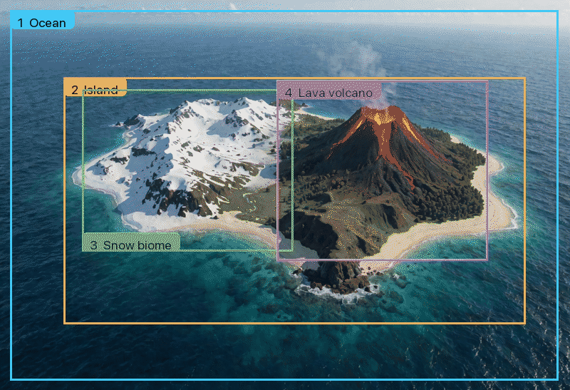

### Depth guide: retain the source structure

Depth Anything V3 extracts the structure of a source image; a Krea 2 Control LoRA locks the generation to it. Source → depth map → result:


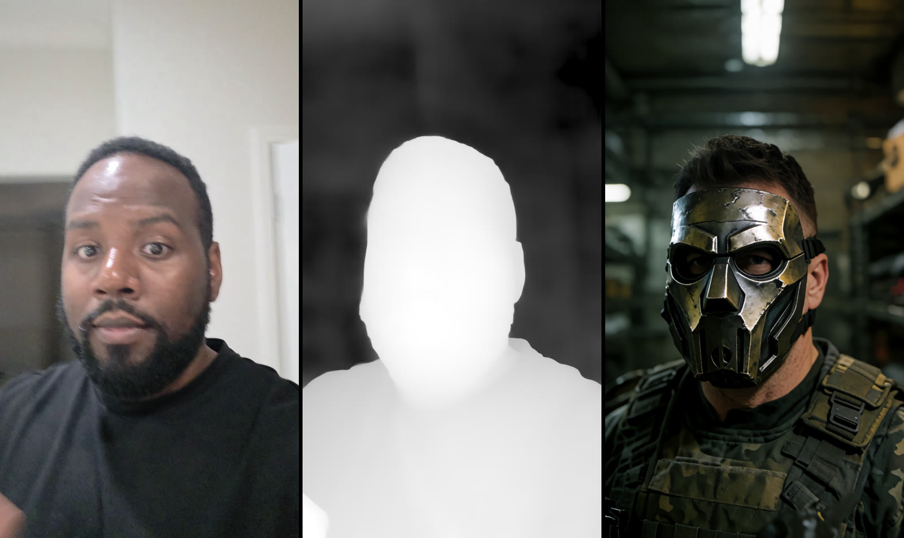

### Reference-guided generation

One reference image steers composition and mood for an entirely new subject.


### Video

Click a link to play the file, or see the videos looping on the [showcase page](https://blackmixture.github.io/Mix-Studio/).

| | |
| --- | --- |
| [**SCAIL 2 motion transfer**: a phone clip of a hand drives motion in a generated fantasy scene](docs/download/media/scail-hand-fantasy.mp4) | [**SCAIL 2 motion transfer**: a dog-walk clip drives a mech and robot-dog scene](docs/download/media/scail-mech-dog.mp4) |
| [**LTX 2.3 Face ID lipsync**: a reference image and voice recording condition one talking-video job](docs/download/media/lipsync-talking.mp4) | [**LTX 2.3 image-to-video**: a still image, motion prompt, and generated audio produce a video](docs/download/media/ltx-shark.mp4) |

### Edit: localized and multi-reference changes

Flux 2 Klein 4B/9B, Qwen Image Edit 2511, and Krea 2 accept prompt-based edits, multiple references, masks, and expanded canvases. Preserve and compositing controls determine which source pixels are restored after generation.

Add up to three Edit inputs, then type `@` to insert a specific image as a prompt token. In this Flux Klein 9B edit, `@Image 1` supplies the character, `@Image 2` supplies the jacket, and `@Image 3` supplies the forest setting.

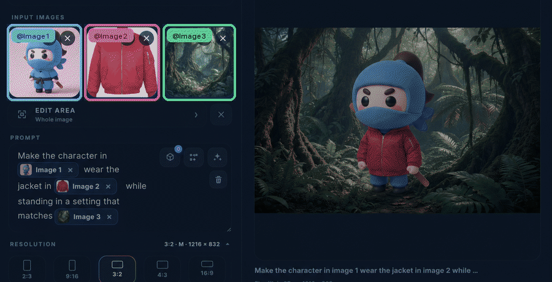

| “Make the man an old black man with a gold chain and a hat” | “Make the rose into a gun” |
| --- | --- |
|  | 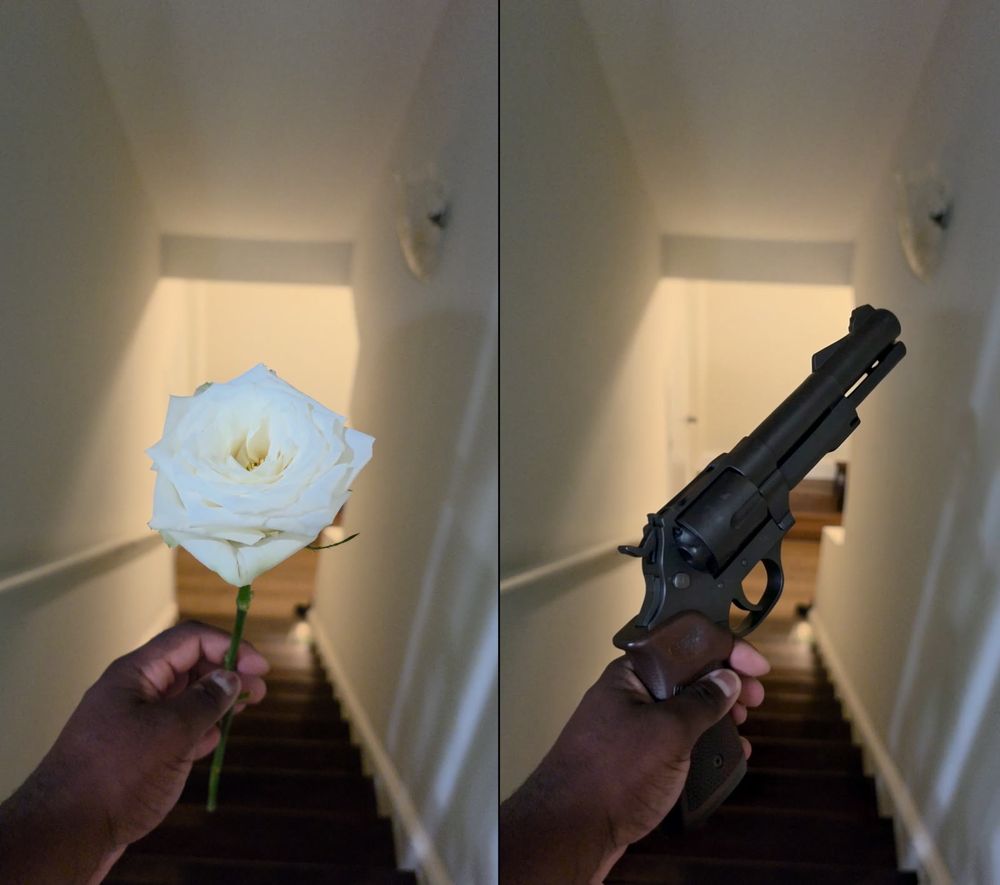 |

| “Make this a 3D render. Wireframe draft view.” | Mask inpainting: paint the face so only the selected area changes |
| --- | --- |
|  | 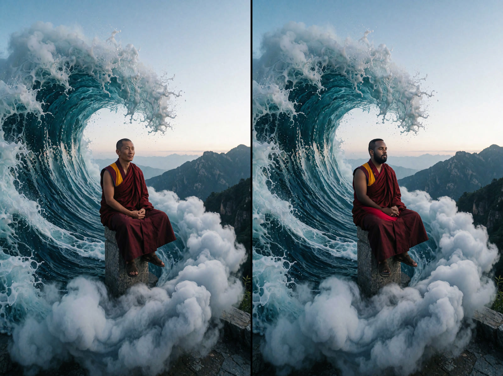 |

## Inside the app

These screenshots show the desktop layout. The same Node.js server provides a touch layout for phones and tablets.

### Create

Build Krea 2 images with reference, depth, or style guidance. The workspace keeps LoRAs, resolution controls, queue state, the active result, and recent outputs visible together.

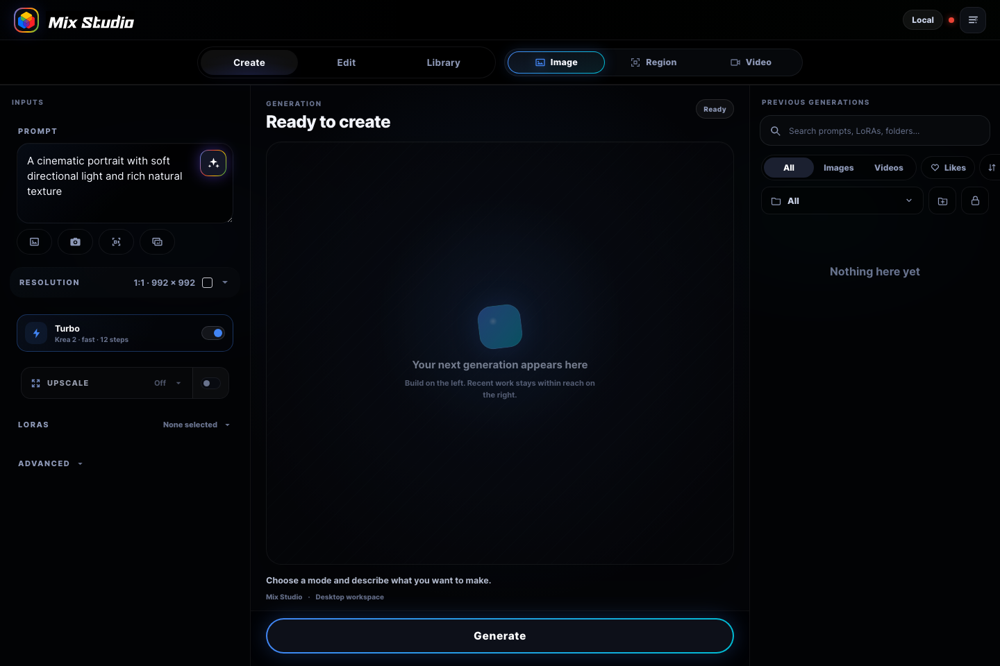

### Region

Define aspect-correct boxes with independent prompts, LoRA stacks, and optional reference images. The server assembles the regions into one Krea 2 graph.

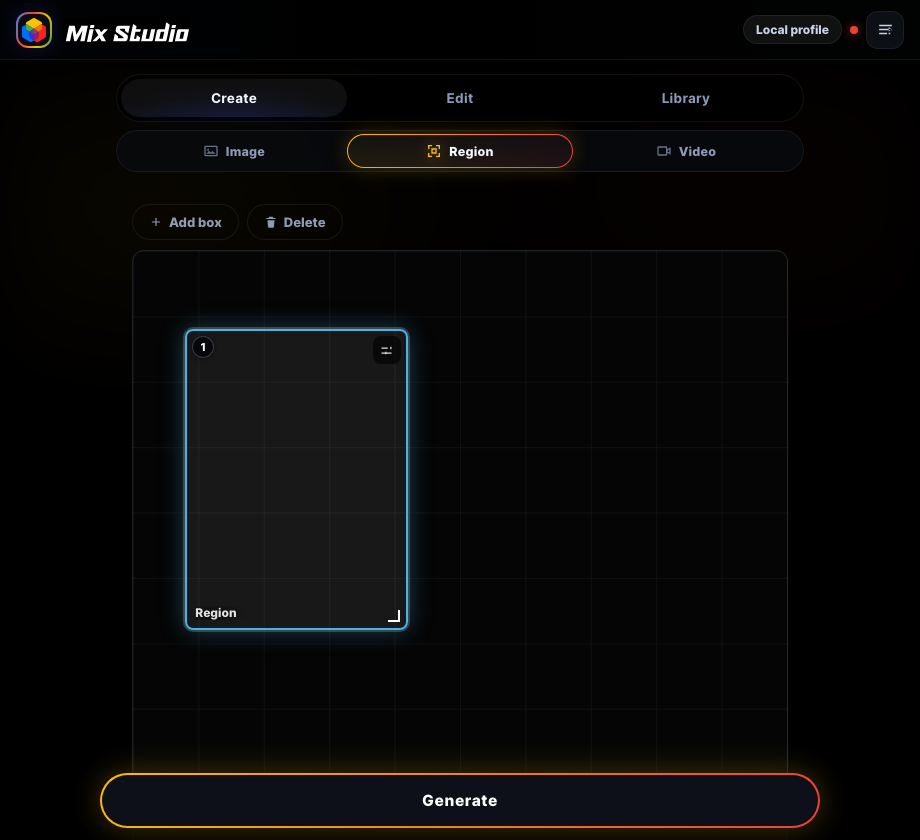

### Edit

Route edits through Flux 2 Klein, Qwen Image Edit, or Krea 2. Multiple inputs, masks, outpainting, preserve controls, and sequential edits remain available in the same workspace.

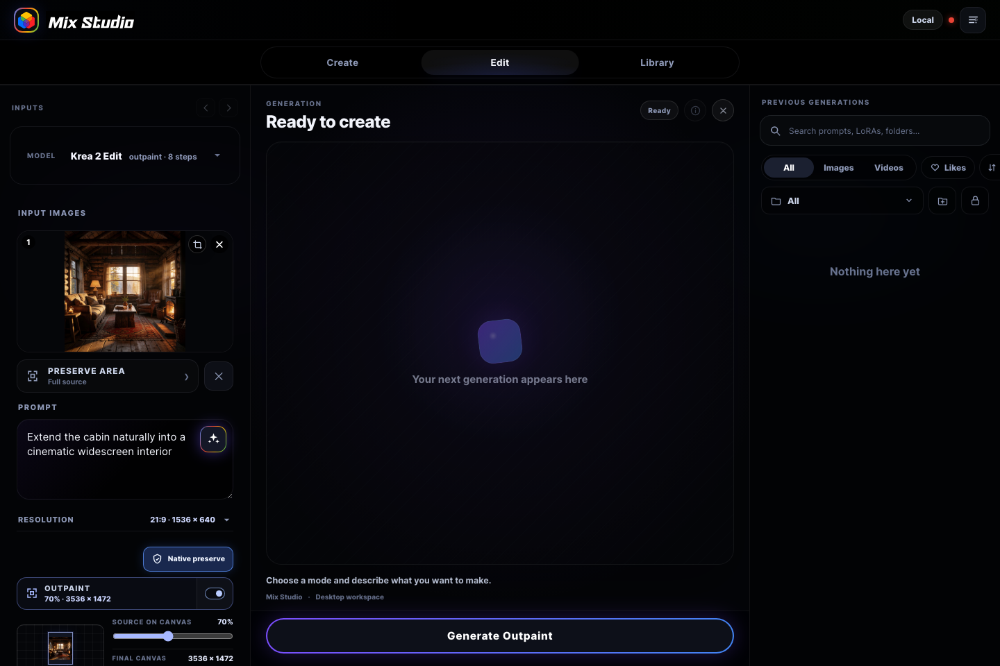

### Video

Use LTX 2.3, Director, Face ID, LTX Edit, 10Eros, Wan 2.2, and SCAIL 2 with the frame, audio, source-video, and motion inputs supported by each route.

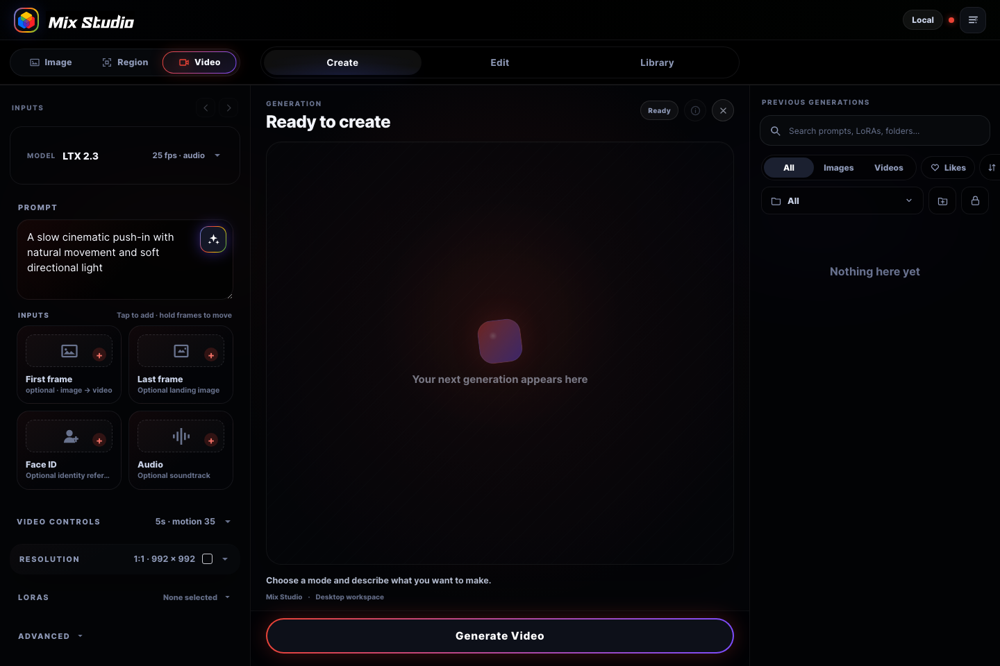

### SCAIL 2 motion transfer

Feed a reference image and trimmed driving video into SAM3 tracking, then generate through stable-chunk or Infinity modes with explicit overlap controls.

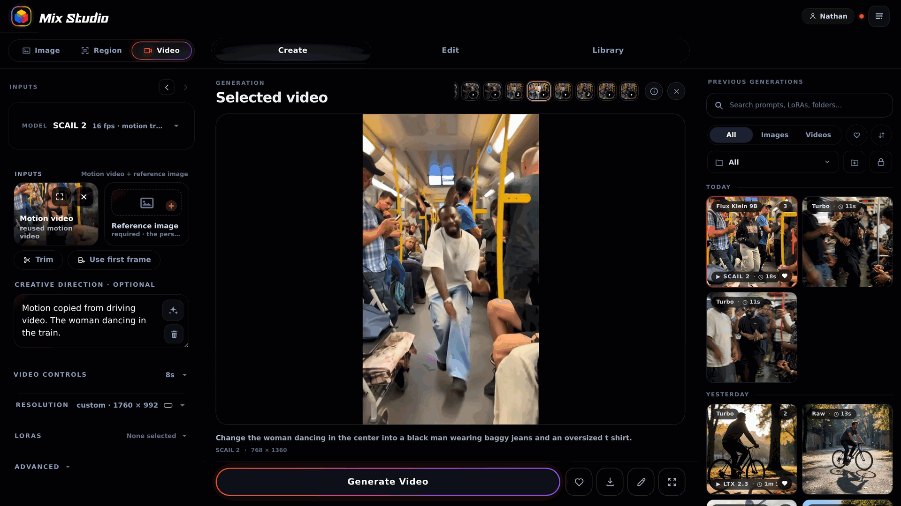

### Library

Search image, video, and uploaded-asset collections. Folders, named groups, saved settings, model metadata, and source relationships remain attached to each result.

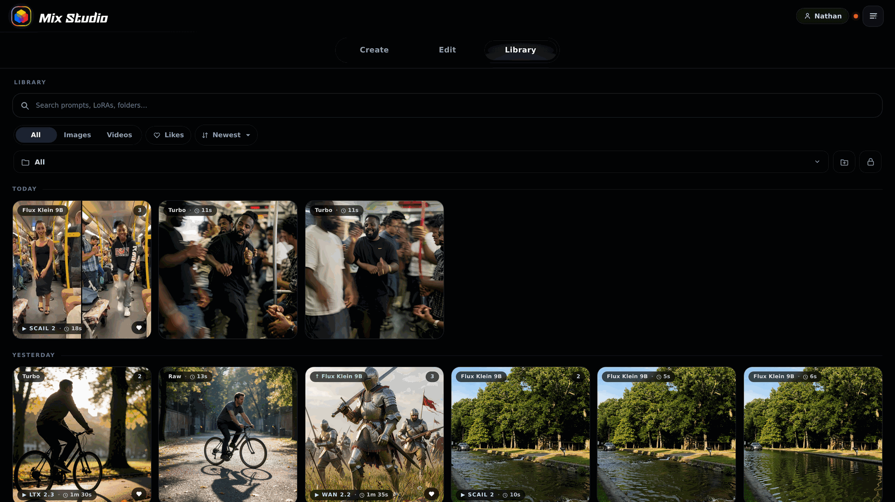

### Focused result view

Inspect generated media with group navigation, prompt and model metadata, reuse actions, and documentation export without leaving the Library context.

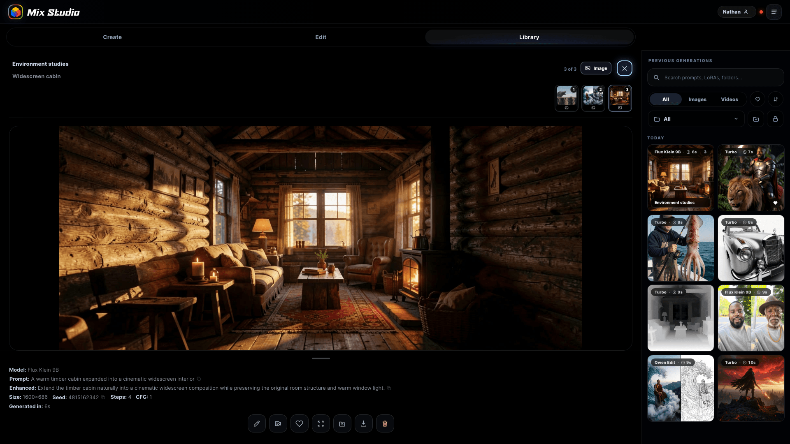

### Upscale comparison

Compare the source and upscaled result with synchronized pan and zoom plus a movable reveal divider.

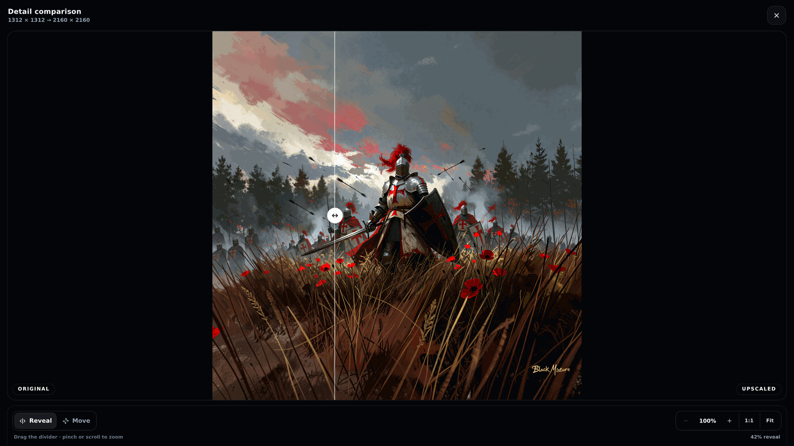

### Profiles

Keep galleries, folders, presets, and form state scoped to each profile, with optional PIN access for private workspaces.

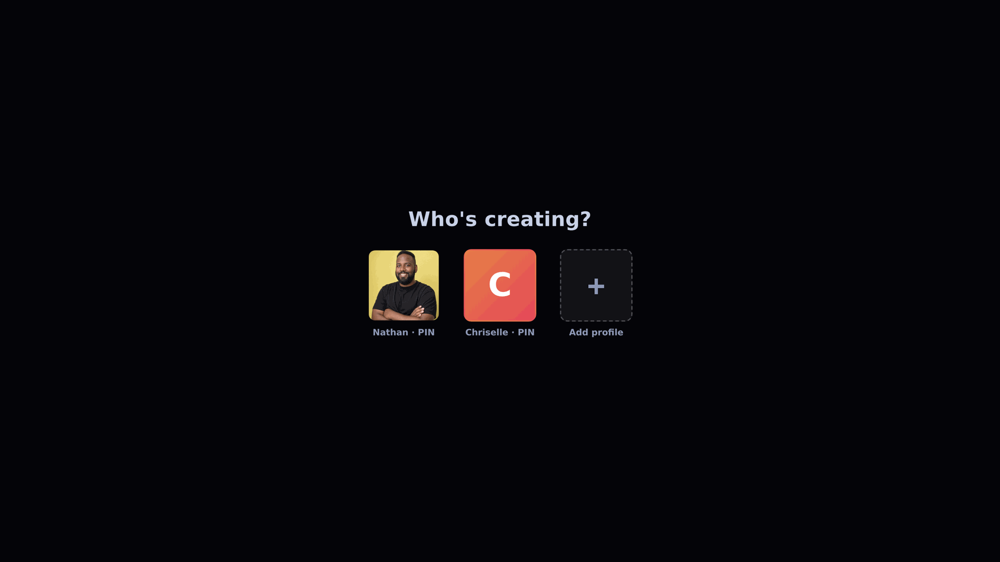

### Generation setup

Inspect the ComfyUI connection, hardware rating, discovered models, custom-node checks, and installation status for each workflow family.

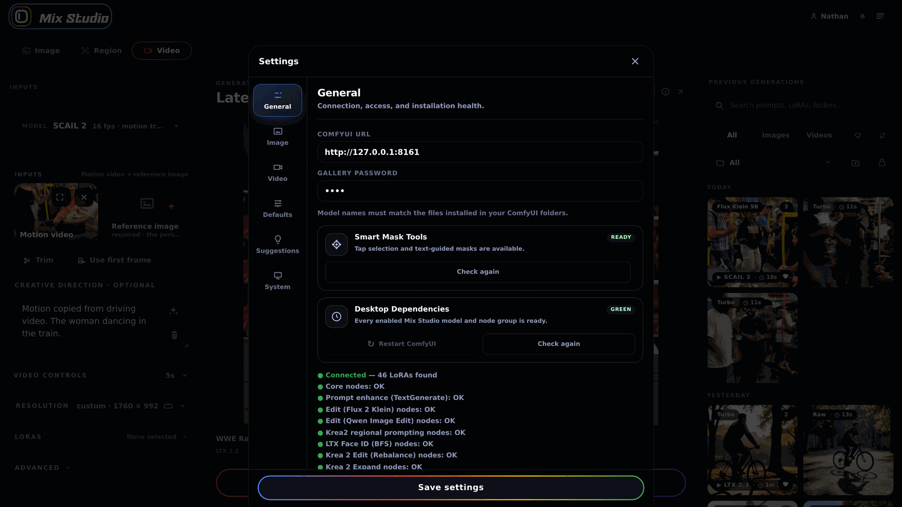

Short clips of the UI in motion: [region prompting](docs/download/media/ui-region-demo.mp4) · [before/after reveal](docs/download/media/ui-compare-demo.mp4)

## Portable Windows install

This project is distributed as a portable Git checkout rather than a packaged executable. That keeps installation transparent for advanced users and lets the owner-only **Update app** button safely run a fast-forward Git update.

The downloadable bootstrap installs Git and Node.js through `winget` when needed, clones the official repository into `%USERPROFILE%\Mix Studio`, starts the local server, and opens Mix Studio in the browser. A fresh installation enters an open **Owner** workspace immediately. ComfyUI, models, and custom nodes are configured later from the web app, only when a generation needs them. Existing ComfyUI installations and completed model files are reused.

### One-file download

On Windows, open the [Mix Studio download page](https://blackmixture.github.io/Mix-Studio/), save **install.bat**, and run it. The downloader fetches the application, starts it, and opens `http://127.0.0.1:3300/`. There is no separate Mix Studio setup wizard before the workspace appears.

When the user first presses Generate, Mix Studio checks the exact workflow they selected. If ComfyUI, models, or nodes are missing, the in-app **Generation setup** panel offers three paths: **Quick setup** installs the recommended image starter, **Install this workflow** downloads only what the current generation requires, and **Full setup guide** exposes ComfyUI detection, manual URL and folder fields, and individual capability groups. The panel reads NVIDIA VRAM, identifies the curated precision variant, and labels model families as recommended, usable with offload, or difficult. Below-tier choices require an explicit warning confirmation. A running ComfyUI is queried for registered model filenames, so matching files are reused even when they live in a shared model root.

### GPU memory and quantized models

Mix Studio targets Windows PCs with NVIDIA GPUs, but it does not enforce a VRAM cutoff. Its lowest guided offload tier is **4 GB of VRAM** through the Flux 2 Klein 4B FP8 edit route with current ComfyUI and model/encoder offloading. This is an offloaded route rather than a claim that the complete pipeline remains resident in 4 GB: [ComfyUI's reference workflow](https://docs.comfy.org/tutorials/flux/flux-2-klein) measures the distilled FP8 pipeline at about 8.4 GB without that constraint. Expect a 4 GB run to be slower.

The curated Krea 2 image route uses **8 GB VRAM** as its guided offload tier and recommends 16 GB. On detected 4–12 GB systems, setup selects the Low VRAM profile; for Krea 2 it recommends the official INT8 ConvRot weights. Native INT8 ConvRot requires ComfyUI 0.27.0 or newer, which Generation setup verifies before installing or running that variant. FP8 remains a visible fallback instead of blocking an otherwise compatible workflow.

Video workflows use **8 GB VRAM** as an experimental offload tier, while 24 GB VRAM remains the practical recommendation for Mix Studio's curated graphs. System RAM is not an installer requirement. This rating means the installer allows and describes the route; it is not a promise that every duration and resolution will fit. [ComfyUI documents an 8 GB native-offload route for Wan 2.2 5B](https://docs.comfy.org/tutorials/video/wan/wan2_2), and [ModelScope documents an 8 GB managed-offload route for LTX-2](https://github.com/modelscope/DiffSynth-Studio). Mix Studio currently uses the heavier Wan 14B and LTX 2.3 22B families, so users at this tier should begin with short, smaller videos and expect long model-loading pauses.

Low VRAM mode never silently changes a request. If an image exceeds roughly one megapixel or batch one, Mix Studio asks whether to use the safer values or continue unchanged.

| Workflow family | Guided offload tier | Practical recommendation | Model route |
| --- | ---: | ---: | --- |
| Flux 2 Klein 4B edit | 4 GB | 16 GB | Official FP8 checkpoint with system-RAM offload |
| Krea 2 image and Krea-based edit | 8 GB | 16 GB | FP8, or native INT8 ConvRot below 16 GB |
| LTX 2.3, LTX Edit, and 10Eros | 8 GB | 24 GB | Combined FP8 checkpoints with aggressive offload |
| Wan 2.2 14B and SCAIL 2 | 8 GB | 24 GB | FP8, or manually configured GGUF diffusion weights |
| Klein 9B and Qwen Edit | 16 GB | 24 GB | Curated BF16/FP8 variants or manually configured GGUF weights |

These are guided VRAM ratings for Mix Studio's curated defaults, not hard compatibility caps or system RAM requirements. Lower resolution or duration, ComfyUI offloading, and manually configured quantized weights can let some workflows run below their listed tier, with slower generation and a greater risk of running out of memory. Mix Studio warns before a below-tier install or generation and lets the user continue unchanged.

Configured `.gguf` diffusion models automatically use the ComfyUI-GGUF loader in the supported Klein, Qwen, Wan, and SCAIL graphs. Guided setup currently installs that loader but does not download third-party GGUF weights or quantized text encoders; select those files manually. LTX 2.3 and 10Eros use combined audio/video checkpoints and cannot use a transformer-only GGUF file as a drop-in replacement, though ComfyUI can still offload parts of those pipelines to system RAM. Krea 2 INT8 ConvRot is not GGUF and uses ComfyUI's standard diffusion loader.

### Manual Git install

1. Install [Git for Windows](https://git-scm.com/download/win) and Node.js 22 or newer.
2. Clone the repository. Do not use GitHub's **Download ZIP** if you want in-app updates:

   ```powershell
   git clone https://github.com/BlackMixture/Mix-Studio.git
   ```

3. Open the cloned folder and double-click **install.bat**. Mix Studio starts and opens directly in the browser.
4. Enter a prompt and press **Generate**. If the selected workflow is not ready, choose **Quick setup**, install only that workflow, or open the full guide.
5. In the full guide, choose the detected ComfyUI environment, enter a URL and folders manually, or launch the signed official ComfyUI Desktop installer.
6. Review the hardware rating before adding larger Edit and Video families. Some selections can add tens of gigabytes or rely heavily on system-memory offload.

The bootstrap writes ignored, machine-specific configuration to `install.json`. Changes made in Generation setup update the ComfyUI connection atomically and merge the URL into `data/settings.json`. Setup never resets `data/db.json`, profiles, gallery media, folders, prompts, or presets.

Optional anonymous product analytics use PostHog and remain disabled unless a public project key is configured. Set `MIXBOX_POSTHOG_KEY` and, for EU Cloud, `MIXBOX_POSTHOG_HOST=https://eu.i.posthog.com` before starting the server, or add an `analytics` object with `key` and HTTPS `host` fields to the ignored `install.json`. The browser SDK uses memory-only persistence, disables autocapture, page views, session replay, surveys, and person profiles, and sends only `App_Launched` plus `Generation_Started` with a public model label. Users see a first-run notice and can disable or re-enable analytics under **Settings → General**. In PostHog, also set **Settings → Project → General → IP data capture** to discard client IP addresses; this server-side project setting is required because browser code cannot prevent a network peer from receiving an IP address.

The console prints two URLs:

   - `Local:  http://localhost:3300`: open on the desktop
   - `Phone:  http://192.168.x.x:3300`: open on a phone connected to the same Wi-Fi

On the phone, use **Add to Home Screen** for an app-like fullscreen experience.

For private access away from home, install [Tailscale](https://tailscale.com/download) on both the Windows desktop and phone, sign both into the same tailnet, then open the `Phone:` URL printed for the Tailscale adapter. The desktop keeps ComfyUI, models, and generated media; the phone remains the touch-first control surface.

If the phone can't connect, allow Node through Windows Defender Firewall (private networks). Port changes via the `PORT` env var.

### ComfyUI and shared models

For new machines, the in-app guide downloads ComfyUI Desktop only from the official stable Windows endpoint and refuses to run it unless Windows reports a valid Authenticode signature. Existing environments can provide their ComfyUI URL, application folder, and models folder. Setup scans the connected `/object_info` registry and common `extra_model_paths.yaml` files, shows what it found, and skips recognized filenames before downloading. If ComfyUI is stopped or uses an unusual configuration location, enter the folders manually; no existing file is moved or duplicated.

You can reopen **Generation setup** later from **Advanced Settings → General** to change the connection or add optional feature families. Rerunning **install.bat** is safe and simply prepares and starts the existing checkout again.

To remove Mix Studio, double-click **uninstall.bat**. The uninstaller removes the portable checkout and, by default, moves its managed `data/` folder to `%LOCALAPPDATA%\Mix Studio\data` so the original checkout path is free for a clean reinstall. A later setup automatically reconnects those profiles, settings, generations, ComfyUI paths, and the last detected hardware profile. Use the explicit `-RemoveData` option only when you also want to erase managed local gallery data and preserved setup metadata; it requires typing `DELETE`. ComfyUI, shared models, mirrored export files, arbitrary external data paths, and the system Node.js installation are never removed. Browser-installed shortcuts, local form settings, and compressed preview caches live on each phone or browser and must be cleared there.

### Installing missing dependencies

In **Advanced Settings → General**, the **Desktop Dependencies** card scans every enabled Mix Studio model and node family. The owner profile can install only the red groups; node packs are cloned into the configured `custom_nodes` directory and their requirements are added with that ComfyUI instance's Python environment **without a blanket pip upgrade**. Before any node requirements are changed, Mix Studio saves a `pip freeze` snapshot under `data/dependency-backups/`. Model files download into the configured shared models folder with live byte progress, and partial downloads are kept as `.mixbox.part` files until complete.

Use **Repair missing tools** after an interrupted install or a custom-node dependency conflict. It reinstalls only the affected packs' declared Python packages, then asks for a ComfyUI restart; it does not reset profiles, gallery data, model files, or unrelated custom nodes.

Some upstream Hugging Face files require accepting a license before their download URL will work. Accept the license on the model page first; if the provider requires authentication, launch Mix Studio with an `HF_TOKEN` environment variable. The card also exposes **Restart ComfyUI** for a configured Windows ComfyUI folder, but it will refuse while either queue is active.

### Updating

Open Mix Studio's side menu and choose **Update app**. Updates require:

- a Git clone with its `.git` directory;
- a named branch and configured `origin` remote;
- no uncommitted tracked code changes; and
- idle Mix Studio and ComfyUI queues.

Machine-specific `install.json` and all `data/` content are ignored by Git, so normal updates do not replace profiles, settings, metadata, or generations. Server-side updates restart the Node process automatically; frontend-only updates do not need a restart.

Mix Studio checks the official `BlackMixture/Mix-Studio` GitHub Releases channel when a profile signs in and every six hours while the app remains open. A newer stable semantic version appears in the Updates inbox with its release notes and an optional browser alert. The check is read-only, cached locally for one hour, and uses no bundled GitHub credentials; only maintainers who can publish a Release in the official repository can notify installations. The local owner still decides when to install it.

Every user-facing release is associated with the semantic version in `release.json` and a matching Git tag such as `v1.1.0`. The side menu and **Advanced Settings → System** show the installed version, while the short Git revision remains available to the update API for diagnostics. Keep `main` release-ready, bump `release.json` when preparing the release, tag that commit, and publish the GitHub Release with the changelog.

The owner can also choose **Restart app** from the same menu. It checks both Mix Studio and ComfyUI queues before restarting the Node server, and is available because `start.bat` launches the server in restart-aware mode.

## Features

### Image and regional generation

- **Krea 2 text-to-image**: Turbo is the default route. Raw can use the Turbo LoRA at 12 steps or the full 52-step CFG path.
- **Image guidance**: a source image can condition composition and color, visual style, or three-dimensional structure. Depth guidance runs Depth Anything V3 and applies the Krea 2 Control LoRA.
- **Prompt tools**: Qwen3-VL provides prompt revision and image-to-prompt analysis. Camera and lens controls produce a reusable prompt fragment.
- **Regional generation**: an aspect-correct editor assigns a prompt, LoRA stack, and optional reference image to each box. The server builds one Krea2RegionalMultiLoRAV3 graph and can export the annotated region map.
- **Resolution and batching**: presets expose exact output dimensions, seed, batch size, and generation-safe or native source matching. Low VRAM requests retain user control and require confirmation before safer settings are substituted.

### Editing

- **Model routes**: Flux 2 Klein 4B/9B, Qwen Image Edit 2511, and Krea 2 have separate graph builders and model-specific sampling controls.
- **Multiple inputs**: numbered reference slots can be reordered and addressed from the prompt with tokens such as `@image-1` and `@image-2`.
- **Localized edits**: SAM3 text and point selection, brush masks, and boxes feed masked edit graphs. Krea 2 uses `VAEEncode` plus `SetLatentNoiseMask` for flow-model-compatible inpainting.
- **Canvas expansion**: outpainting supports source placement, optional organic preserve masks, and source-pixel compositing after generation.
- **Edit sets**: sequential mode runs prompt sentences in order, and camera variation mode creates grouped view, elevation, and framing variants. Focused results retain original-to-result comparison and saved input settings.

### Video generation, editing, and motion transfer

- **LTX 2.3**: two-stage text-to-video and image-to-video generation with first and last frames, joint audio generation, uploaded audio, waveform trimming, and motion controls.
- **LTX Director**: Extend continues an existing clip, Keyframes arranges images, clips, and directions as a storyboard, and Timeline places story, audio, and motion segments at explicit frame ranges. Projects can be saved as JSON.
- **LTX Face ID**: Best-FaceID and BFS overlap conditioning preserve a reference identity. An uploaded voice is encoded into the audio latent with a zero noise mask for lipsync.
- **LTX Edit**: an experimental source-video route applies a literal edit prompt to uploaded or generated footage.
- **10Eros DMD**: reference-conditioned generation with the Echo sampler and selectable sigma presets.
- **Wan 2.2**: dual-expert image-to-video sampling with fast and full-quality paths.
- **SCAIL 2**: a driving video and reference image feed SAM3 tracking and WanSCAILToVideo. Stable chunks and Infinity modes extend the supported duration while retaining overlap controls.
- **Video processing**: compatible outputs can run RIFE interpolation, RTX 4K upscaling, source extension, and side-by-side comparison. Reuse restores both settings and input assets.

### LoRAs and parameter comparison

- LoRA stacks are stored separately for Create, Edit, Video, and regional inputs. Cards support enable state, exact or gesture-based strength changes, thumbnails, search, trigger phrases, and profile-scoped presets.
- **Strength Hunt** keeps the prompt and seed fixed while stepping one or two selected LoRAs from 0 to each LoRA's configured maximum in 0.2 increments. The server submits the comparison as one queue job, saves every individual output, and adds a labeled square or matrix documentation image to the same gallery group.

### Library, reusable assets, and output records

- The Library indexes images, videos, audio uploads, prompts, LoRAs, model metadata, duration, generation time, folders, likes, and user-defined group names.
- Generated images, attached videos, Strength Hunts, camera variants, and manual groups retain their parent and child hierarchy. Miniature group navigation and previous or next controls work in both the center stage and focused view.
- Focused images support wheel zoom and drag or trackpad pan. The action row can reuse media in another workflow, save original files, build documentation images, extend video, upscale, compare, group, move, or delete.
- Uploaded image, video, and audio assets remain available as reusable workflow inputs in an Uploaded assets collection. Unused assets can be moved to the recoverable trash from the Library.
- Custom folders support merge and optional PIN locking. Search, date navigation, sort, drag-sweep multi-select, ZIP export, composites, and optional desktop-folder mirroring operate on profile-scoped records.

### Upscaling, queue state, and system operation

- **Upscaling**: SeedVR2 and Ultimate SD Upscale support target-resolution and multiplier modes. The comparison viewer synchronizes pan and zoom and provides reveal, 1:1, and fit controls.
- **Queue**: each ComfyUI prompt is tracked with node-specific progress, overall progress for multi-stage jobs, ETA estimates, duration, thumbnail, cancellation, reordering, history, and GPU health. Strength Hunts remain one logical queue item.
- **Profiles**: signed-cookie sessions isolate gallery items, folders, history, LoRA presets, Face ID records, and saved form state. Profiles can use an optional PIN, and the first profile owns administrative actions.
- **Generation setup**: hardware detection, ComfyUI registry scanning, model discovery, custom-node checks, precision selection, and low-VRAM recommendations run before a missing workflow is submitted.
- **Maintenance and recovery**: the owner can update or restart Mix Studio and ComfyUI only while both queues are idle. The database is backed up at boot and every 30 minutes, and deleted media is moved to `data/trash/` before permanent removal.

ComfyUI's disaster-recovery copies are organized under `ComfyUI/output/MixStudio/<profile-name>_<profile-id>/`, with separate prefixes for images, edits, videos, upscales, posters, and composites. Existing files in the legacy `ComfyUI/output/KreaStudio/` folder are left untouched.

## ComfyUI requirements

All model filenames and the ComfyUI URL are editable in **Advanced Settings**; changes apply automatically, and a contextual restart action appears when needed. Generation setup health-checks every node group. Highlights: Krea 2 (unet/clip/vae), Krea 2 Depth Control LoRA + Depth Anything V3 Large, Krea 2 Identity Edit LoRA + ComfyUI-Krea2Edit for outpainting, Flux Klein 4B/9B, Qwen Image Edit 2511, LTX 2.3 (+ spatial upscaler, Gemma encoder), Wan 2.2, 10Eros, SCAIL-2 (+ SAM3 multiplex, clip_vision_h), Best-FaceID LoRA + [ComfyUI-BFSNodes](https://github.com/alisson-anjos/ComfyUI-BFSNodes), SeedVR2, KJNodes, VideoHelperSuite, ComfyUI-Frame-Interpolation (RIFE), Krea2-Regional-MultiLoRA.

## Where things live

- `data/db.json`: item, folder, profile, preset, and face metadata; `data/backups/`: rolling database snapshots
- `data/images/`, `data/videos/`: generated media; `data/faces/`, `data/avatars/`, `data/lorathumbs/`: reusable thumbnails and identity images
- `data/settings.json`: model and connection configuration; `data/auth_secret.txt`: session-signing secret
- `data/trash/`: recoverable media from deleted gallery items, videos, and profiles; the owner can permanently clear it from **Advanced Settings → System → Trash**

`data/` is deliberately not in git. Private folders are lightweight UI privacy: locked folders hide their items from gallery responses, but files remain on disk.

## Contribute a Workflow

Workflow contributions are evaluated for API-format graph compatibility, repeatable output, dependency scope, and whether the controls can be represented clearly in the existing interface.

### What We Look For

- **Performance:** Document a practical memory tier, including a 4 GB offloaded or quantized route when the model supports one, plus appropriate 8 GB, 12 GB, 16 GB, or 24 GB targets for larger workflows.
- **Stability:** Include fixed node and model versions where behavior depends on a specific upstream implementation.
- **Scope:** Identify the user task, required inputs, exposed controls, output types, and how the workflow should behave in the queue and Library.

### How to Submit

Submit a workflow through one of these routes:

- **[GitHub Discussions](https://github.com/BlackMixture/Mix-Studio/discussions):** Share a ComfyUI JSON graph for technical review before implementation.
- **[Pull Requests](https://github.com/BlackMixture/Mix-Studio/pulls):** Submit the graph builder, UI controls, dependency manifest entries, and tests together when the integration is already implemented.

When you submit, please include:

- A concise description of the workflow and intended use case.
- All model files, encoders, VAEs, LoRAs, and custom nodes, including tested versions.
- Tested VRAM, system RAM, resolution or duration, and generation time.
- Example inputs, outputs, and the original ComfyUI workflow JSON.

## License

Mix Studio is free and open source software licensed under the **[GNU General Public License v3.0](LICENSE)**, the same copyleft license used by ComfyUI.

You may use, study, modify, and redistribute Mix Studio, including for commercial purposes. If you distribute Mix Studio or a modified version, the GPL requires you to provide the corresponding source code under GPLv3 and preserve the license and copyright notices. You can run the app privately and modify it for yourself without publishing those private changes.

The GPL applies to Mix Studio's source code and documentation unless a file says otherwise. ComfyUI, custom nodes, model weights, and other third-party components keep their own licenses and terms. Mix Studio does not claim ownership of media users create; use of generated media remains subject to applicable law and the licenses or terms of the models involved.

## Acknowledgments & Attribution

Mix Studio depends on ComfyUI, open model releases, and community workflow implementations.

**ComfyUI:** Executes the API-format graphs built by the Mix Studio server.

**Model creators:** Black Forest Labs (Flux 2), Lightricks (LTX 2.3), Krea AI, and the Wan team provide the primary image and video model families used by the curated workflows.

**Community projects:** SCAIL 2, 10Eros, SeedVR2, Ultimate SD Upscale, Depth Anything V3, and the required ComfyUI custom-node projects supply specialized conditioning, tracking, sampling, and upscaling components.

**Hardware:** Dell provided the Dell Pro Max T2 Tower used for development and high-memory benchmarking. The test system contains an **NVIDIA RTX PRO 6000 Blackwell GPU with 96 GB VRAM**.
