

  

<h1 align="center">
  
</h1>

<strong>A clean, responsive AI workspace.</strong> Run curated image and video workflows from your desktop or phone. Built on ComfyUI.

  
  
  
  

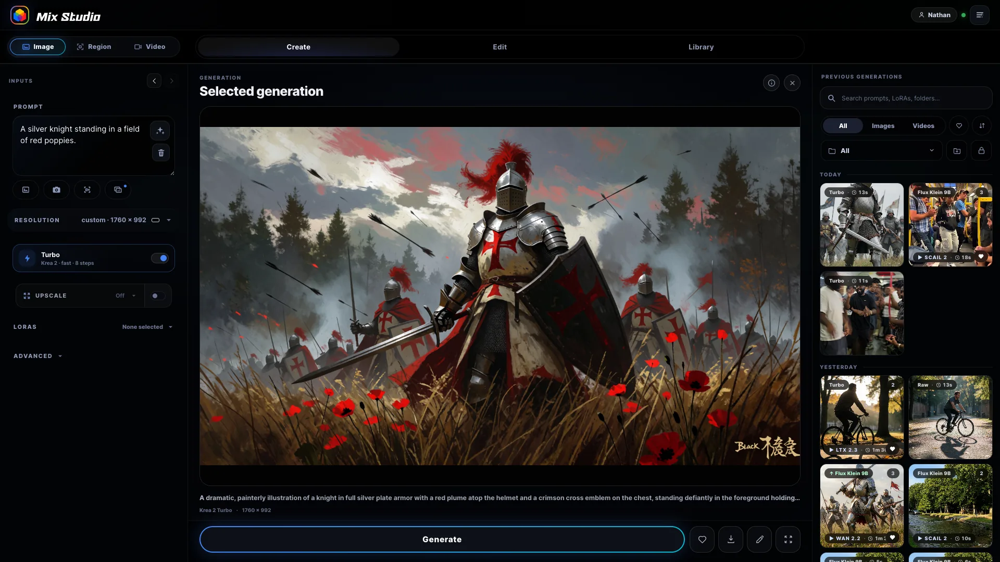

Mix Studio is a local web interface that builds and submits ComfyUI API graphs for image generation, regional prompting, image editing, video generation, motion transfer, and upscaling. Its curated model families include Krea 2, Flux 2 Klein, Qwen Image Edit, LTX 2.3, Wan 2.2, 10Eros, and SCAIL 2.

Krea 2 editing includes Identity Edit v1.2 and the multi-reference **Krea 2 Remix** workflow, with an advanced Reference boost control for stronger identity and subject guidance.

- **Create from anywhere:** use the same touch-friendly workspace on the Windows desktop, a phone on the same Wi-Fi, or privately through Tailscale.
- **Keep the power of ComfyUI:** reuse your installation, models, custom nodes, queue, and recovery outputs.
- **Stay local and in control:** prompts, inputs, generated media, profiles, and galleries remain on your computer.
- **Skip the node graph rebuilds:** work through focused controls while Mix Studio assembles the graph for each job.

## Quick setup

1. Open the **[Mix Studio download page](https://blackmixture.github.io/Mix-Studio/)** and save `install_MixStudio.bat`.
2. Put the installer in the parent folder where you want Mix Studio to live, then run it. For example, placing it in `D:\AI` creates `D:\AI\Mix Studio`.
3. Mix Studio opens in your browser, detects an existing ComfyUI installation, and guides you through the files required by the workflows you choose.

Windows with an NVIDIA GPU is the supported path. The lowest guided route is a 4 GB offloaded edit workflow; 16 GB VRAM is the practical image recommendation and 24 GB is recommended for larger video workflows.

For manual Git setup, detailed VRAM guidance, shared-model discovery, phone access, troubleshooting, and uninstall behavior, see **[Installation and operations](docs/installation-and-operations.md)**. Do not use GitHub's **Download ZIP** if you want in-app updates.

## Features

| Workspace | Highlights |
| --- | --- |
| **Create** | Krea 2 Turbo and Raw, exact resolution and seed controls, batching, LoRAs, prompt enhancement, reference, style, and depth guidance. |
| **Region** | Aspect-correct boxes with independent prompts, LoRA stacks, and reference images combined into one coherent generation. |
| **Edit** | Flux 2 Klein, Qwen Image Edit, Krea 2 Identity Edit, and Krea 2 Remix with multiple inputs, `@Image` tokens, masks, inpainting, outpainting, and source preservation. |
| **Video** | LTX 2.3, Director, Face ID lipsync, LTX Edit, 10Eros, Wan 2.2, and SCAIL 2 motion transfer with audio and frame controls. |
| **Upscale** | SeedVR2 and Ultimate SD Upscale with synchronized zoom, pan, and an interactive before-and-after reveal. |
| **Library** | Searchable images, videos, and uploads with profiles, folders, groups, reusable settings, metadata, recoverable trash, and ZIP export. |

Mix Studio also includes thumbnail-based Visual Presets, installable prompt preset packs, LoRA presets and **Strength Hunt**, guided Generation setup, live queue progress and cancellation, automatic database backups, and a responsive desktop and phone interface.

## Showcase

Everything below was generated locally in Mix Studio. More examples, including autoplaying video, are on the **[showcase and download page](https://blackmixture.github.io/Mix-Studio/)**.

### Regional prompting

Each box can carry its own prompt, LoRA stack, and reference image. Mix Studio resolves the regions into one generation.

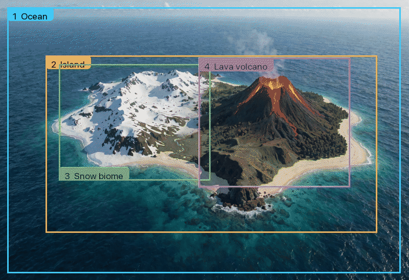

### Outpainting

A square generation continued into a seamless 21:9 interior.

### Multi-reference editing

Add up to three Edit inputs, then type `@` to insert a specific image as a prompt token. Here, `@Image 1` supplies the character, `@Image 2` the jacket, and `@Image 3` the forest.

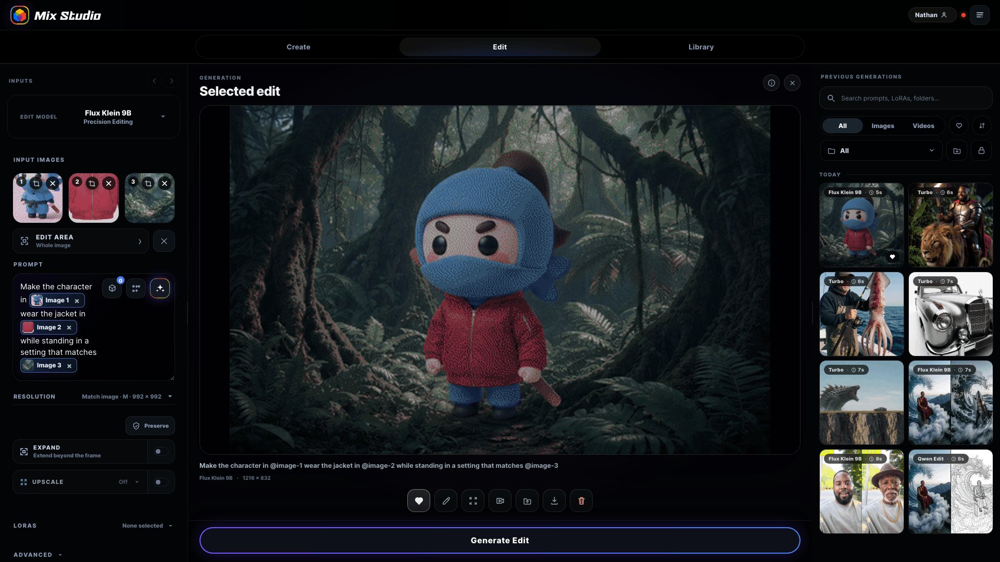

### Video and motion

- [SCAIL 2 motion transfer: hand motion drives a fantasy scene](docs/download/media/scail-hand-fantasy.mp4)
- [LTX 2.3 Face ID lipsync: reference image and voice recording](docs/download/media/lipsync-talking.mp4)
- [LTX 2.3 image-to-video with generated audio](docs/download/media/ltx-shark.mp4)

## Inside the app

The desktop workspace and touch layout expose the same projects, controls, and Library.

### Create

Krea 2 generation with prompt, LoRA, resolution, queue, and recent-output controls.

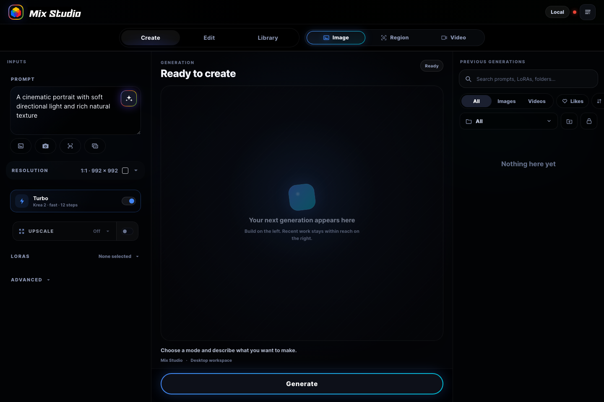

### Region

Aspect-correct boxes with independent prompts, LoRA stacks, and optional references.

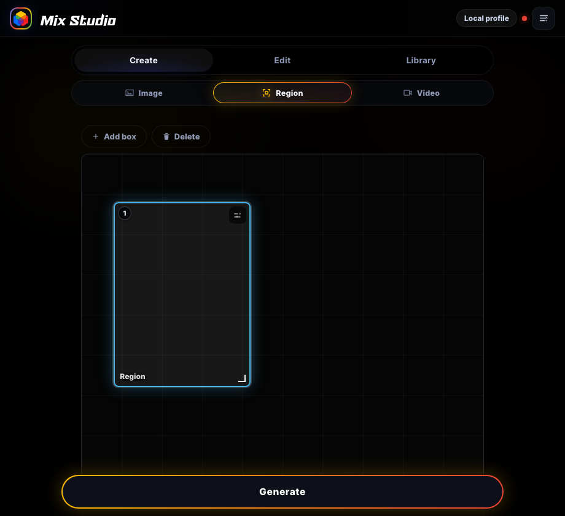

### Edit

Flux 2 Klein, Qwen Image Edit, Krea 2 Identity Edit, and Krea 2 Remix in one workspace.

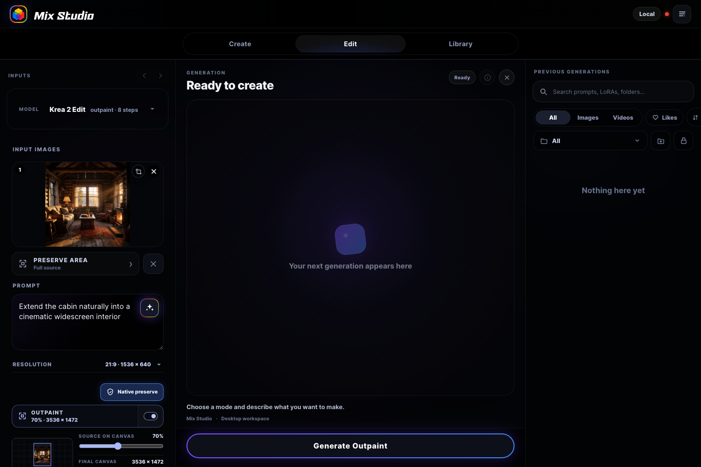

### Video

LTX 2.3, Director, Face ID, LTX Edit, 10Eros, Wan 2.2, and SCAIL 2 controls.

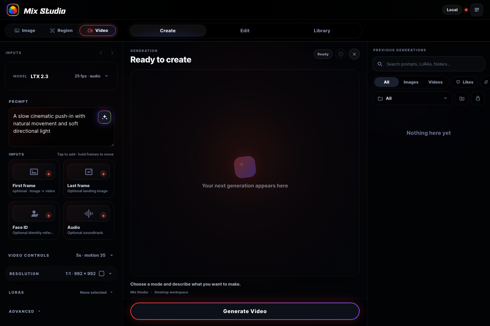

### SCAIL 2 motion transfer

Reference image, trimmed driving video, tracking, and chunk controls.

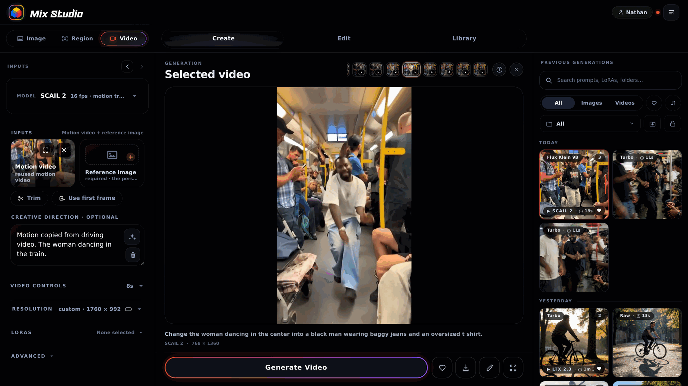

### Library

Searchable generations and uploads with folders, groups, metadata, and reusable settings.

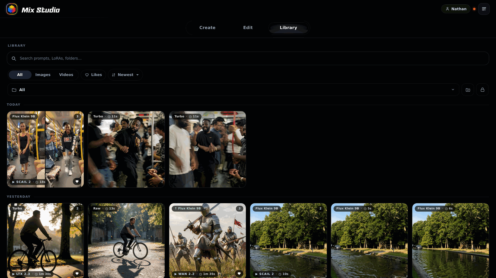

### Focused result view

Inspect a result, navigate its group, review metadata, and send it into another workflow.

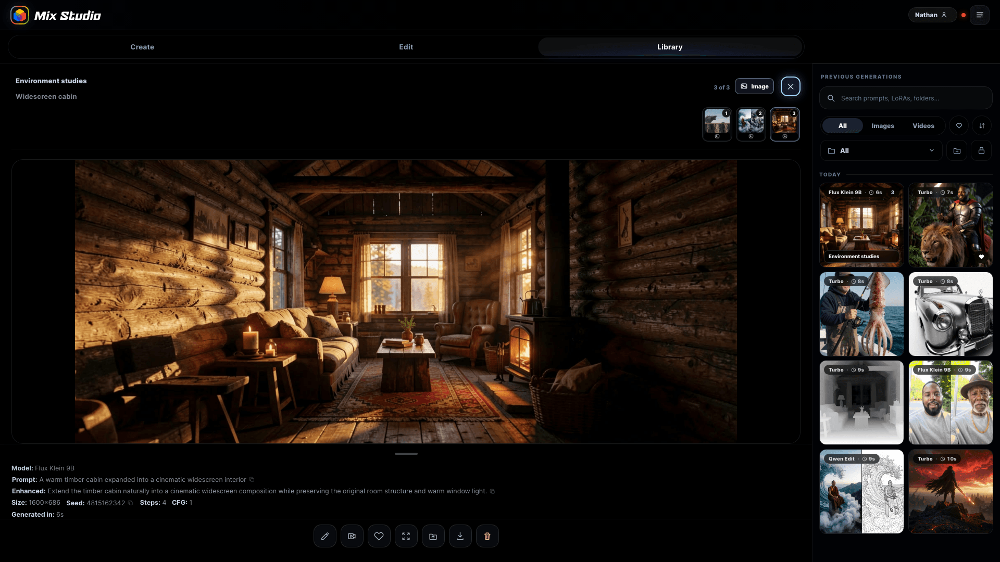

### Upscale comparison

Synchronized pan and zoom with a movable before-and-after divider.

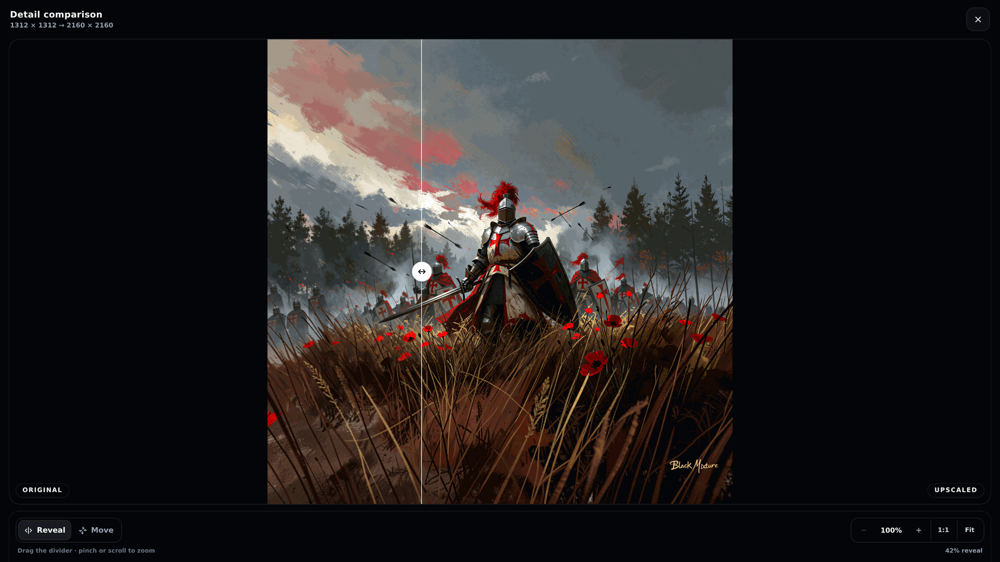

### Profiles

Separate local workspaces with optional PIN access.

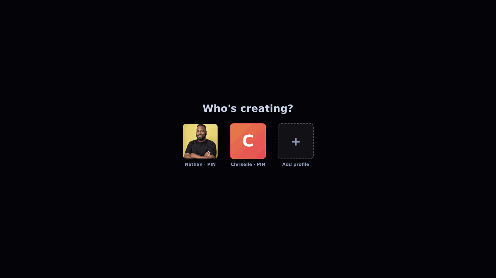

### Generation setup

ComfyUI connection, hardware guidance, discovered models, and dependency checks.

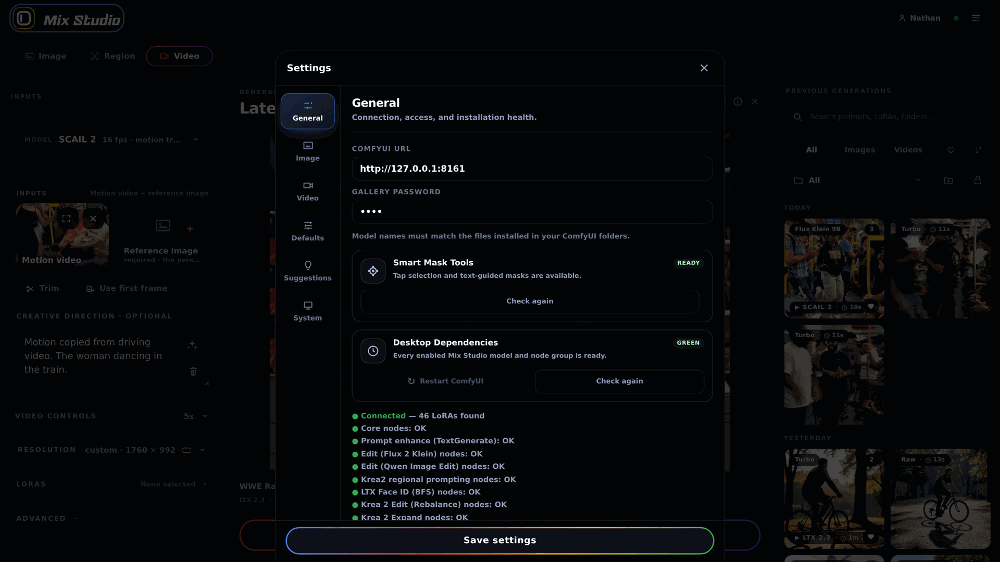

## Updates

Open the side menu and choose **Update app**. Mix Studio installs a fast-forward update when its Git checkout is clean and both the Mix Studio and ComfyUI queues are idle. Your machine settings, profiles, gallery, and generated media are kept outside the tracked application files.

Published releases appear in the in-app **Updates inbox** with their release notes. Server updates restart Mix Studio automatically; interface-only updates reload without a server restart.

For update requirements, recovery behavior, and the maintainer release process, see **[Installation and operations](docs/installation-and-operations.md#updating)**.

## Documentation

- **[Installation and operations](docs/installation-and-operations.md):** setup, hardware guidance, ComfyUI discovery, updates, phone access, repair, and uninstall.
- **[Technical reference](docs/technical-reference.md):** workflow behavior, required ComfyUI components, queue operation, and local data layout.
- **[Changelog](CHANGELOG.md):** user-facing release notes.
- **[Contributing](CONTRIBUTING.md):** development checks and workflow-submission requirements.

## Contributing

Bug reports, workflow proposals, and implementation pull requests are welcome. Start with **[CONTRIBUTING.md](CONTRIBUTING.md)**, then use [GitHub Discussions](https://github.com/BlackMixture/Mix-Studio/discussions) for a workflow review or [open a pull request](https://github.com/BlackMixture/Mix-Studio/pulls) when the integration is ready.

## License

Mix Studio is free and open source software licensed under the **[GNU General Public License v3.0](LICENSE)**.

The GPL applies to Mix Studio's source code and documentation unless a file says otherwise. ComfyUI, custom nodes, model weights, and other third-party components retain their own licenses and terms. Mix Studio does not claim ownership of media users create.

## Acknowledgments & Attribution

**ComfyUI:** Executes the API-format graphs built by the Mix Studio server.

**Model creators:** Black Forest Labs (Flux 2), Lightricks (LTX 2.3), Krea AI, and the Wan team provide the primary image and video model families used by the curated workflows.

**Community projects:** SCAIL 2, 10Eros, SeedVR2, Ultimate SD Upscale, Depth Anything V3, and the required ComfyUI custom-node projects provide specialized conditioning, tracking, sampling, and upscaling components.

**Hardware:** Dell provided the Dell Pro Max T2 Tower used for development and high-memory benchmarking. The test system contains an **NVIDIA RTX PRO 6000 Blackwell GPU with 96 GB VRAM**.
